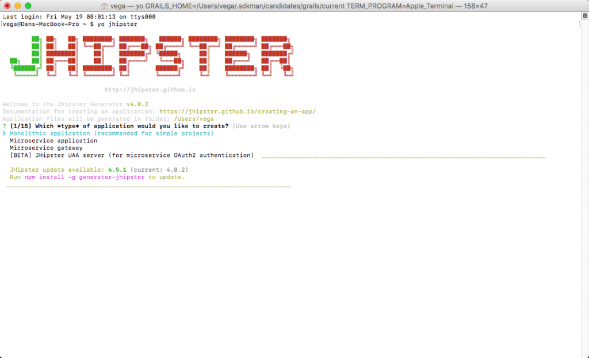
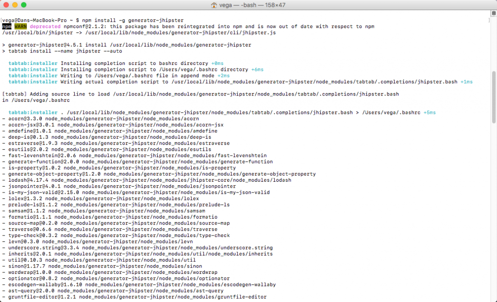

The last few months of my life have been full of Angular + Spring Boot projects and I have been having a blast. When you start building these types of applications you need to start looking into JHipster.  \[featured-image single\_newwindow="false" alt="Greetings Java Hipster"\] If you're new to JHipster I wrote up a tutorial titled ["What is JHipster & Why you need to start using it today"](https://therealdanvega.com/blog/2017/04/19/what-is-jhipster). In this short post, we are going to look at how to tell what version of [JHipster](https://jhipster.github.io/) you're running and how to tell if there are updates available. If there are updates available you will wanna upgrade to the current version. This is not a tutorial on upgrading a current application from one version to another as there is a little more work involved in that.

## Upgrading JHipster

To tell what version of JHipster you are running simply open up command prompt and type the following

yo jhipster

You will see that the current version of JHipster is 4.0.2 and there is an update available for 4.5.1. The helpful command prompt also shows you how to update by giving you the command to run.  To update run

npm install -g generator-jhipster

## UPCOMING COURSE

I want all of you reading this to that I love this project so much that I have decided to launch a course on it. If you want to find out more about this please click on the link below.  

[Spring Boot & Angular Course](https://therealdanvega.com/jhipster)

## Conclusion

I hope this little JHipster tip was helpful but I am also curious what type of projects you are looking to build with JHipster. _**Question:** What problems are you facing in your Angular + Spring Boot projects._