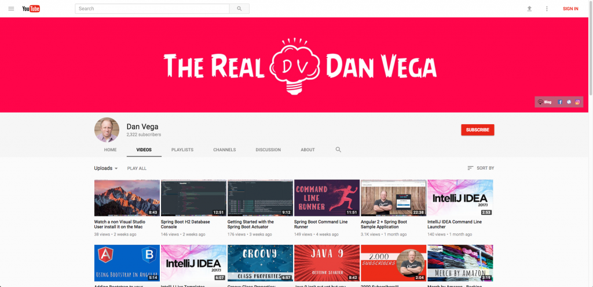

I recently received a really good question from a reader and I thought I would share it with you today and give you my thoughts on it. 

> Hello Dan, After reading your about me page ("I am a self-taught programmer who firmly believes that you can accomplish anything in this life if you put your mind to it, roll up your sleeves and are willing to put in the work."). I am really motivated to try new things and felt a rush of excitement. I wanted to ask if you get stuck on understanding new technology what do you do? I personally constantly google and use stack overflow. But it always takes some time to understand. Lastly, what books do you recommend a newbie programmer to read? Congrats on your upcoming wedding and honey moon. Thank you, Jesse

\[featured-image single\_newwindow="false" alt="What do you do when you stuck on new technology"\] Thank you so much, Jesse, for taking the time to reach out to me. 

## Invest in yourself

I don't know about you but I feel extremely lucky to live in a time where information is so accessible. Try and think back to when your parents or grandparents were your age and wanted to learn something new. They had to drive to the library or go to a bookstore just to get their hands on a book. They also didn't have a review system to tell them what other real people thought of the book and if it helped them learn the subject. What if they wanted to find an actual person that was a subject matter expert?   We all take information a little bit for granted these days because it is at our fingertips every single time we pull out our phone. We have access to books, audio books, blogs, articles, podcasts, and courses. If you want to become an expert on anything you can as long as you want to put in the work.  I am not saying it's going to be easy and nor should it be. Anything worth having in your life should take some sacrifice and work. For almost 18 years now, I have spent days, nights and weekends continually perfecting my craft and learning. The greatest thing you can do is invest in yourself! 

## Resources

If you're still reading this and you want to invest in yourself let's talk about how we are going to do this and what we can do when we get stuck. I have never been someone who can learn from just one resource and I usually use more than one of the following when I want to learn something new.

### Books

The first thing I do when I want to learn a new subject is to pick up a book or 2. A great place to start is Amazon because you can get reviews from real people to see if this book is going to give me what I want. You can also reach out to followers on Social Media to see if anyone has suggestions on a book for a particular subject. I am old school and love to have the physical copies but you can go with whatever your preference is.   If you're learning on a budget you can find lots of really good eBooks for cheap and even free. I also use Github as there are often [lists like this one of free programming books](https://github.com/EbookFoundation/free-programming-books/blob/master/free-programming-books.md#groovy).

### Blogs & Articles

When I am learning a new subject I try and find subject matter experts and one of the easiest ways to do this is to find some bloggers. Bloggers, like myself, usually work in the field and share their experiences which are a valuable resource for you. You can learn from someone's experiences in the exact thing you are trying to learn. If you like what they are writing you can always comment on their posts and develop a dialog with the author.  Another great resource is [Medium](http://www.medium.com). I love it because it is a great collection of articles and you can usually find authors that might not turn up in a google search. I also write articles on Medium so if you would like to, [please follow me](https://medium.com/@therealdanvega). 

### Video

While reading about how to do something there really is nothing like being able to watch someone do something. YouTube is always one of the go-to resources when I want to learn something new. As programmers, we can read up on something day and night but it might just not click until we see someone else actually do it. As with books and courses, I try to find channels with lots of great reviews, comments, and subscribers. Just like bloggers, this is a great opportunity to comment on the videos and develop a dialog with the author.  

### Courses

As I said in the previous section YouTube and video more specifically are my go-to resource. While YouTube can be great for learning a very specific thing it's not great for learning an entire subject. This is where courses come in over the last few years have gotten really freaking good. There are so many quality courses out there that don't cost a lot of money and they are taught by real people working in the field you are trying to get into.  These are some of my favorite places to take courses online.

*   [Udemy](https://www.udemy.com)
*   [Coursera](https://www.coursera.org/)
*   [SkillShare](http://www.skillshare.com/)
*   [edX](https://www.edx.org/)
*   [Lynda](http://www.lynda.com/)
*   [Code School](https://www.codeschool.com/)
*   [Treehouse](https://teamtreehouse.com/)

### Podcasts & Audiobooks

I really love podcasts and audiobooks. While they aren't great for learning a particular programming language they are great for learning about what is new in the community. I usually listen to podcasts in the car, at the gym or on an outdoor walk/run. 

## Information Overload

We went through some really great resources in this section but I do want to warn you about information overload. With so many resources available it is very easy to get caught up in learning and not doing. You need to find a balance of learning and then taking action with what you have learned. You will often hear this referred to as _"Shiny Object Syndrome"_ and it is the disease of distraction.  

## What to do when we get stuck

So we mentioned some great resources in this article to take advantage of when you want to learn a new subject but what happens when you get stuck?  

### Google

I know Jesse mentioned this but I think this is usually the first thing we all try. If you have a specific error message try including that in your search. This is usually going to lead us to one of the following resources.

### Stack Overflow

If you search for an error chances are you are going to end up on [Stack Overflow](https://stackoverflow.com/). This is a great resource for asking questions and getting answers. 

### Slack

Slack is a great tool for communicating with teams or communities. I would look to see if the technology you're learning has a slack channel. I love the [Grails Framework](https://grails.org) and they happen to have a [Slack Channel](http://slack-signup.grails.org/) and it has become a valuable resource for many. 

### Courses

When you take a course make sure that you have access to some type of forums or a way to contact the instructor. If you are stuck on a particular problem that you are learning in the course this is the first place I would turn. 

### Facebook Groups

I find Facebook groups really valuable. This is a chance to join a community of people who are interested in the same thing that you are. Find a group for the subject you are trying to learn and get involved. This doesn't mean always asking questions when you get stuck. This is a 2-way street and if you are going to ask questions try and answer questions or comment on other posts when you can.

### Ask a coworker or friend.

I am lucky to work with some amazing developers so this is always another great resource. If you have friends or coworkers this is a great chance to get a 2nd set of eyes on the problem. Sometimes you have just been too invested in a problem and can't see the simple answers that a fresh set of eyes can contribute. 

### Walk Away

Sometimes you just need to take a break and walk away. If you have exhausted all of your options it is time to pull this one out. Take an hour, take a day but please take a break. Spend some time with friends, take a walk or just relax. This problem isn't going anywhere and you can always come back to it later.

## Conclusion

I want to thank Jesse for the question and the kind words.  _**Question:** What are your favorite resources for learning or getting answers?_