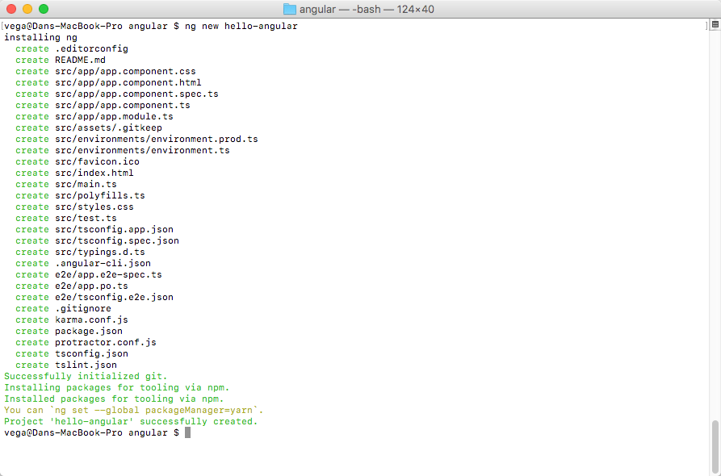
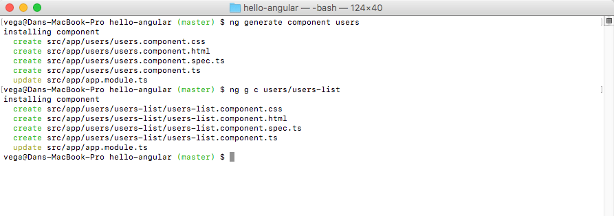
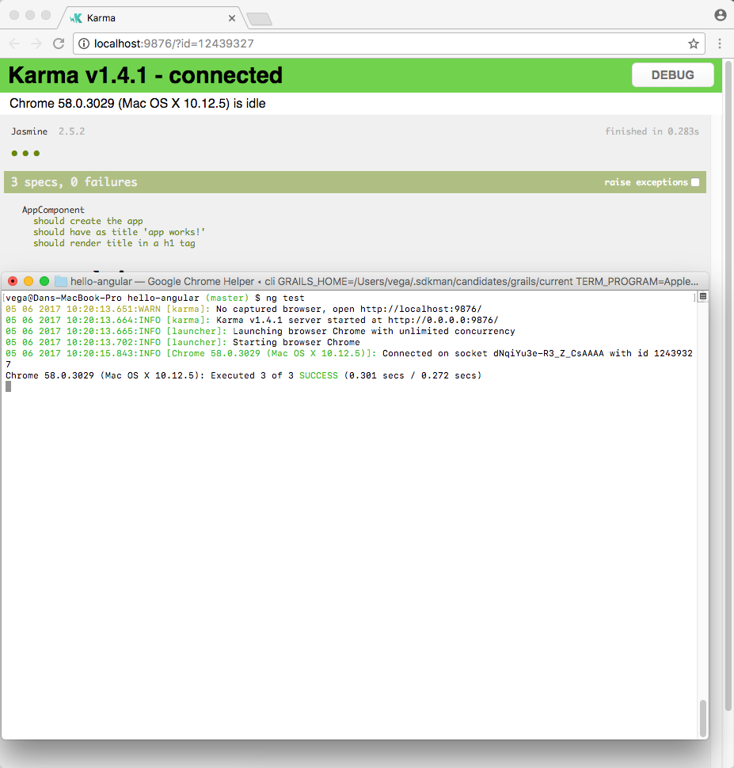

I have worked on a variety of Angular applications over the last few months and it truly has been a blast. I know a lot of my readers out there are Java + Spring developers and I want to make sure that I make this very clear in this post and the ones that follow. If you played around with Angular 1.xx and didn't really enjoy writing those applications you need to come back for another look. \[featured-image single\_newwindow="false" alt="Angular CLI"\] Writing angular 2/4 applications with Typescript is a familiar setting for Java Developers. I really do love working with the Angular framework and in today's article, I am going to help you get started quickly by using the [Angular CLI](https://cli.angular.io/).

## What is the Angular CLI

The Angular CLI is a tool to initialize, develop, scaffold and maintain [Angular](https://angular.io/) applications. The CLI in Angular CLI stands for Command Line Interface and you have probably come across similar tools before. If you're using Spring Boot we use the Spring Initializr to initialize our applications and there is a Spring CLI to accomplish this from the command line. 

## Getting Started with the Angular CLI

The first thing you need to do is to make sure you have [node](https://nodejs.org/en/) & [npm](https://www.npmjs.com/) installed. You can check the versions for each by opening a command line and running the following commands. 

node -v
npm -v

[](./2017-06-05_10-02-47.png) With those in place, you can install the Angular CLI by running the following command. 

```
npm install -g @angular/cli
```

Once installed you can always run the following command to see what version of the Angular CLI you're running. 

ng -v

[](./2017-06-05_10-05-08.png)

### Creating and Running your new Project

The first thing you're going to want to do with your shiny new toy is to create a new project. To do that we are simply going to run the following command. 

ng new your-project-name-here

You will want to run this from the directory where you want your new project to be created. The Angular CLI will create the folder and all the files you need to get started.  [](./2017-06-05_10-10-56.png) When that is finished you are ready to go. Navigate to the project folder (cd hello-angular) and run the following command. 

ng serve

Navigate to [http://localhost:4200/](http://localhost:4200/). The app will automatically reload if you change any of the source files.

### Generating Blueprints

Another very useful command is the generate command. 

ng generate \[name\]

This will allow you to generate the following blueprints. 

*   [class](https://github.com/angular/angular-cli/wiki/generate-class)
*   [component](https://github.com/angular/angular-cli/wiki/generate-component)
*   [directive](https://github.com/angular/angular-cli/wiki/generate-directive)
*   [enum](https://github.com/angular/angular-cli/wiki/generate-enum)
*   [guard](https://github.com/angular/angular-cli/wiki/generate-guard)
*   [interface](https://github.com/angular/angular-cli/wiki/generate-interface)
*   [module](https://github.com/angular/angular-cli/wiki/generate-module)
*   [pipe](https://github.com/angular/angular-cli/wiki/generate-pipe)
*   [service](https://github.com/angular/angular-cli/wiki/generate-service)

We won't go through them all but I will walk through one example here. When you get into Angular development you will quickly realize that everything is component based. When we want to create a new component like a users component to manage the users we can run the following command. 

ng generate component users

[](./2017-06-05_10-28-11.png) _\* We can also use the shortcut **ng g c users**_ When you run this command you can see that it will generate CSS & HTML along with the component and test typescript files. If you want to generate a child component just give the full path for your component.  [](./2017-06-05_10-31-30.png)

### Testing

Angular uses the [Karma Test Runner](https://karma-runner.github.io/1.0/index.html) for all of its testing needs. If you run the following command the Angular CLI will spin up a test runner for you and run all of your tests. Tests will execute after a build is executed via [Karma](http://karma-runner.github.io/0.13/index.html), and it will automatically watch your files for changes. You can run tests a single time via  `--watch=false`  or  `--single-run` . [](./2017-06-05_10-20-41.png)

## Conclusion

The Angular CLI is the best way to get started with Angular development. I hope anyone who looked at Angular in the past and decided it wasn't for them gives it another shot. It is a really great framework with a set of tools that makes writing Angular applications a breeze.  _**Question:** Have you looked at the latest version of Angular and if so what are your thoughts? _