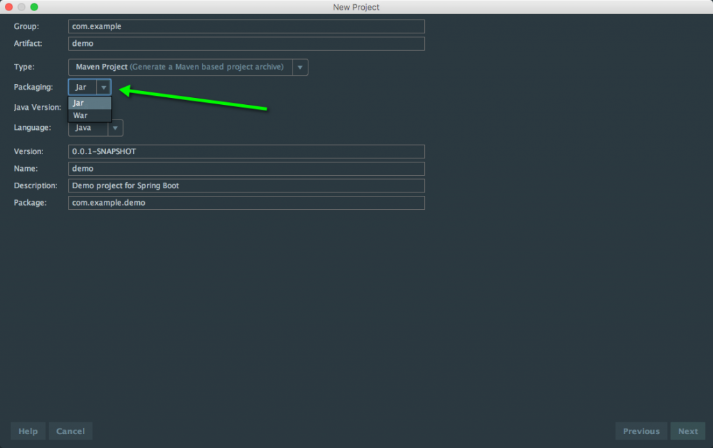
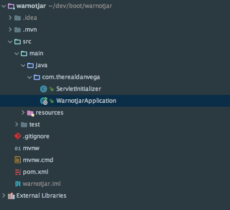
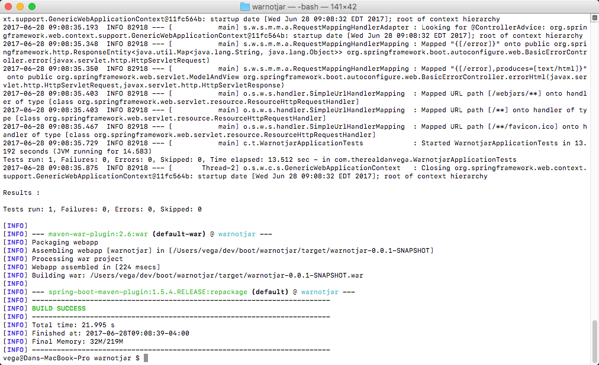

In this tutorial, we are taking a look at a student's question from my [Spring Boot Introduction Course](https://therealdanvega.com/spring-boot). We might not realize it but when we start a new project we are selecting how we want to package this application when we ready to go live.  \[featured-image single\_newwindow="false" alt="Spring Boot: Package as WAR"\] I recently received the following question from a student: 

> In the real world, an application will be deployed to an application server like JBoss. How can the application be wrapped into a war file and deploy to the application server?

Thank you for the question and now let's dive into the answer. 

## WAR vs JAR

The first thing we need to discuss is what is the difference between a WAR and a JAR. _WAR_ stands for Web Application Archive and is deployed on a Servlet Container like Tomcat or Jetty. _JAR_ stands for **J**ava **AR**chive and this will contain and embedded servlet container like Tomcat. These are two very different ways of deploying an application but I can assure that in the "real world" deploying a JAR file is very common. 

## Selecting your Package Type

When you create a new project using the Spring Initializr you have the option to select how you want to package your application.    

## Converting a Spring Boot JAR Application to a WAR

We don't always get the opportunity to create a new project from scratch, so what happens when you're working on an existing project? If you have a Maven based project that is already using JAR as its packaging type you might have a POM that looks like this. 

<?xml version="1.0" encoding="UTF-8"?>
<project xmlns="http://maven.apache.org/POM/4.0.0" xmlns:xsi="http://www.w3.org/2001/XMLSchema-instance"
	xsi:schemaLocation="http://maven.apache.org/POM/4.0.0 http://maven.apache.org/xsd/maven-4.0.0.xsd">
	<modelVersion>4.0.0</modelVersion>

	<groupId>com.therealdanvega</groupId>
	<artifactId>warnotjar</artifactId>
	<version>0.0.1-SNAPSHOT</version>
	<packaging>jar</packaging>

	<name>warnotjar</name>
	<description>Demo project for Spring Boot</description>

	<parent>
		<groupId>org.springframework.boot</groupId>
		<artifactId>spring-boot-starter-parent</artifactId>
		<version>1.5.4.RELEASE</version>
		<relativePath/> <!-- lookup parent from repository -->
	</parent>

	<properties>
		<project.build.sourceEncoding>UTF-8</project.build.sourceEncoding>
		<project.reporting.outputEncoding>UTF-8</project.reporting.outputEncoding>
		<java.version>1.8</java.version>
	</properties>

	<dependencies>
		<dependency>
			<groupId>org.springframework.boot</groupId>
			<artifactId>spring-boot-starter-web</artifactId>
		</dependency>

		<dependency>
			<groupId>org.springframework.boot</groupId>
			<artifactId>spring-boot-starter-test</artifactId>
			<scope>test</scope>
		</dependency>
	</dependencies>

	<build>
		<plugins>
			<plugin>
				<groupId>org.springframework.boot</groupId>
				<artifactId>spring-boot-maven-plugin</artifactId>
			</plugin>
		</plugins>
	</build>

</project>

We can use 3 very simple steps to convert our application to use WAR as the package type. 

### Step 1: Adding the Servlet Initializer Class

In an application where we are using JAR as the package type, we only need the main application class that looks like this. 

package com.therealdanvega;

import org.springframework.boot.SpringApplication;
import org.springframework.boot.autoconfigure.SpringBootApplication;

@SpringBootApplication
public class WarnotjarApplication {

	public static void main(String\[\] args) {
		SpringApplication.run(WarnotjarApplication.class, args);
	}
}

In our WAR deployment, we are going to add another class that will help configure our web application. We are going to add a new class called Servlet Initializer that looks like this. You could also extend your main application class if you like and override configure in that class but I like separating this out. 

package com.therealdanvega;

import org.springframework.boot.builder.SpringApplicationBuilder;
import org.springframework.boot.web.support.SpringBootServletInitializer;

public class ServletInitializer extends SpringBootServletInitializer {

    @Override
    protected SpringApplicationBuilder configure(SpringApplicationBuilder application) {
        return application.sources(WarnotjarApplication.class);
    }

}

In my example, I am using my main application class (WarnotjarApplication.class) as an argument to the sources method. You should end up with the main application class and a class called ServletInitializer.    

### Step 2: Update the Tomcat Dependency

In our Spring Boot Starter Web dependency, there is a Tomcat dependency declared. We can't go in and make a change there but we can make the change in our POM. We need to change that dependency to say that this will be provided for us. 

<dependency>
	<groupId>org.springframework.boot</groupId>
	<artifactId>spring-boot-starter-tomcat</artifactId>
	<scope>provided</scope>
</dependency>

### Step 3: Change the package type to war

<groupId>com.therealdanvega</groupId>
<artifactId>warnotjar</artifactId>
<version>0.0.1-SNAPSHOT</version>
<packaging>war</packaging>

## Packaging your application

With those changes in place, you can now package your application. 

./mvnw package

 If you look inside of the /target folder now you should see the war file. You can now take that file and deploy on your servlet container. 

## Spring Boot WAR Screencast

https://youtu.be/92ceKwUZoA0

## Conclusion

Spring Boot makes it easy for us to package our applications to fit our needs. I hope this tutorial showed how easy it was to convert an existing JAR application over to a WAR.  _**Question:** What Spring Boot Deployment issues are you facing?_